# Iconic
## User Manual
- Version 1.5
- 02/11/2018
- Document Number: 1.0
- [Source Code](https://github.com/koosvary/Iconic)

## Table of Contents
* [Introduction](#introduction)
* [Overview](#overview)
  + [Conventions](#conventions)
  + [Cautions & Warnings](#cautions---warnings)
    - [General](#general)
    - [Input Data](#input-data)
    - [Process Data](#process-data)
    - [Results](#results)
* [Getting Started](#getting-started)
  + [Set-up Considerations](#set-up-considerations)
  + [Screens](#screens)
    - [Input Data](#input-data-1)
    - [Process Data](#process-data-1)
    - [Define Search](#define-search)
    - [Start Search](#start-search)
    - [Results](#results-1)
    - [Dialogs](#dialogs)
  + [Running a search](#running-a-search)
  + [Exiting the System](#exiting-the-system)
* [Using the System](#using-the-system)
  + [Create a New Project](#create-a-new-project)
  + [Import or Create a Dataset](#import-or-create-a-dataset)
    - [Import a Dataset](#import-a-dataset)
    - [Create a Dataset](#create-a-dataset)
  + [Add a Search](#add-a-search)
  + [View & Edit a Dataset](#view---edit-a-dataset)
  + [Export a Dataset](#export-a-dataset)
  + [Viewing Feature Data](#viewing-feature-data)
  + [Preprocess Data](#preprocess-data)
    - [Smooth Data](#smooth-data)
    - [Handle Missing Values](#handle-missing-values)
    - [Normalise Scale](#normalise-scale)
    - [Remove Outliers](#remove-outliers)
    - [Offset Values](#offset-values)
  + [Define Search Parameters](#define-search-parameters)
    - [Select a dataset](#select-a-dataset)
    - [Target Function](#target-function)
    - [Building Blocks](#building-blocks)
      * [Building block list](#building-block-list)
    - [General Parameters](#general-parameters)
      * [Error Metric](#error-metric)
      * [Population Size](#population-size)
      * [Generations](#generations)
      * [Mutation](#mutation)
      * [Mutation Rate](#mutation-rate)
    - [Gene Expression Programming Specific Parameters](#gene-expression-programming-specific-parameters)
      * [Head Length](#head-length)
      * [Crossover](#crossover)
      * [Crossover Rate](#crossover-rate)
    - [Cartesian Genetic Programming Specific Parameters](#cartesian-genetic-programming-specific-parameters)
      * [Number of Outputs](#number-of-outputs)
      * [Number of Columns](#number-of-columns)
      * [Number of Rows](#number-of-rows)
      * [Number of Levels Back](#number-of-levels-back)
  + [Searching](#searching)
    - [Start a Search](#start-a-search)
    - [Stop a Search](#stop-a-search)
    - [Pause & Resume a Search](#pause---resume-a-search)
    - [View Search Progress](#view-search-progress)
  + [Results](#results-2)
    - [View Results Table & Solution Fit Plot](#view-results-table---solution-fit-plot)
    - [Exporting a Solution](#exporting-a-solution)
* [Using the Command-Line](#using-the-command-line)
  + [Synopsis](#synopsis)
  + [Description](#description)
  + [Type of Algorithm](#type-of-algorithm)
  + [Choosing the Input File](#choosing-the-input-file)
  + [Number of Outputs](#number-of-outputs-1)
  + [Number of Generations](#number-of-generations)
  + [Size of Population](#size-of-population)
  + [Primitives to Use](#primitives-to-use)
  + [Crossover Probability](#crossover-probability)
  + [Mutation Probability](#mutation-probability)
  + [Number of Repetitions](#number-of-repetitions)
  + [Graphing the Results](#graphing-the-results)
  + [Exporting the Results as CSV](#exporting-the-results-as-csv)
  + [Cartesian-Specific Parameters](#cartesian-specific-parameters)
    - [Number of Columns](#number-of-columns-1)
    - [Number of Rows](#number-of-rows-1)
    - [Number of Levels Back](#number-of-levels-back-1)
* [Support & Contact](#support---contact)

## Introduction

Iconic is an open source evolutionary algorithm framework developed by a group of 10 students at the University of Newcastle (UoN) in collaboration with Dr. Markus Wagner from the University of Adelaide (UoA) and Prof. Pablo Moscato from the University of Newcastle. It was developed as part of their Final Year Project for the Bachelor of Engineering (Software)(Honours) program.
The Iconic Software Ecosystem has 3 main components: The **Iconic CLI** - a command line interface that allows users to run the Iconic System in a bare-bones, lightweight manner, the **Iconic Workbench** - a graphical user interface that gives users an accessible and easy way to operate the system, and the Iconic API - the underlying logic that both interfaces use to perform calculations and analysis.

This User Manual (UM) provides the information necessary for users to effectively use the **Iconic Workbench** and the **Iconic CLI**.  It is up-to-date as of Iconic v0.7.0 released 02/11/2018. This document provides an overview of all screens in the **Iconic Workbench**, a guide on how to get started, and a list of each feature provided by the workbench. It also provides information and examples on how to use the **Iconic CLI**.

## Overview

The **Iconic Workbench** provides a standalone graphical user interface over the Iconic API. It allows users to easily import and modify datasets, preprocess data and start evolutionary searches to find an expression which represents the data. The Iconic Workbench aims to provide users an easy way to generate predictive models for their data.

The key features it provides are:
* Two evolutionary algorithms
    * Cartesian Genetic Programming
    * Gene Expression Programming
* Modifiable search parameters
* Import, modify and export datasets all within the application
* Preprocess data with a variety of functions such as normalise and smooth
* Plot found solution results against dataset

The **Iconic CLI** is a simple, light-weight command-line tool designed to give more advanced users the ability to expedite the generation of models without relying on a graphical user interface. The current version uses the Global Simple Evolutionary algorithm for Multiple Objectives (GSEMO) to minimise mean squared error and genome size. It takes a single input file, a population size and a number of generations.

Below is a high-level diagram of how both the **Iconic Workbench** and **Iconic CLI** integrate with the Iconic API to provide their functionality.

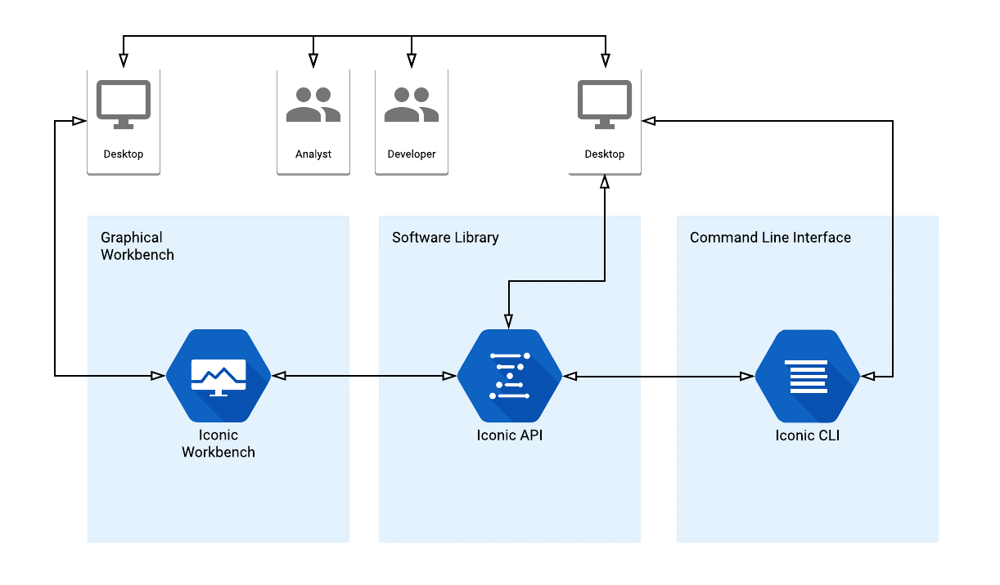

### Conventions

The term ‘user’ is used throughout this document to refer to a person who requires and/or has acquired access to the **Iconic Workbench** or **Iconic CLI**.

### Cautions & Warnings

Below is a list of known bugs with the Iconic Workbench. For an optimal experience, please refrain from replicating the following scenarios:

#### General

1. Most buttons in the menu bar do not work. Please be aware that using these buttons may not have the desired effect

#### Input Data

1. CSV data may contain a small amount of CSV header information at the start of the file. This will cause the Iconic Workbench to display "" prepended to the first row of the dataset
    * This will not affect performance if the CSV contains a feature header row
    * If the CSV does not contain a feature header row, the CSV header information will cause the first row in the dataset to be taken as a feature header row
2. Iconic Workbench does not support importing, saving or exporting the "info" row in a dataset

#### Process Data

1. Applying the "Remove Outliers" transformation on a feature with missing values may lock the preprocessing options for that feature
    * This is due to the following: Features with missing values must have those missing values handled before any other transformations can be applied. The user enables "Handle Missing Values", which then unlocks the other transformation functions. If "Remove Outliers" is then enabled, this will cause the feature to move back into a missing values state if outliers are removed, and the other transformations become locked. Since "Handle Missing Values" is already enabled and was applied before "Remove Outliers", the feature remains in a missing values state.
2. Changing the threshold for "Remove Outliers" will require the user to disable and re-enable "Handle Missing Values"
    * Once outliers are removed, the feature goes into a missing values state, locking all transformations except "Handle Missing Values". The user must then apply "Handle Missing Values" to unlock the other transformations. If the user changes the threshold for "Remove Outliers", it will be applied after "Handle Missing Values". This can be resolved by disabling and re-enabling "Handle Missing Values"

#### Results

1. Selected result does not remain selected when the results table is updated
2. Cartesian Genetic Programming searches may not output all results when number of outputs > 1
3. Coefficients are not truncated to 3d.p.


## Getting Started

Below is an overview of each of the screens in the **Iconic Workbench**, followed by a short guide on how to run your first search.

### Set-up Considerations

Java Runtime Environment version 8 or higher must be installed to use the **Iconic Workbench**. It can be downloaded [here](https://www.java.com/en/download/)

To optimize utilisation of the **Iconic Workbench**:
1. Screens are designed to be viewed at a screen resolution of 1920 x 1080.

### Screens

#### Input Data

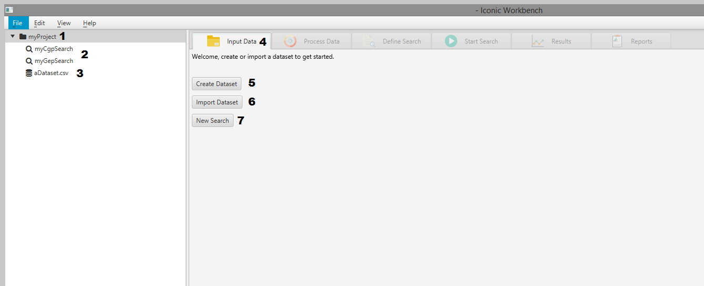

1. Project tree
2. Searches in the project
3. A dataset in the project
4. The Input Data tab
5. Create Dataset button
6. Import Dataset button
7. Create New Search button

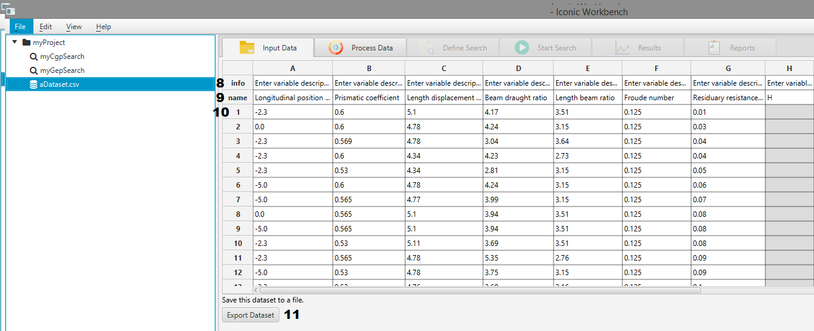

8. Information/Description row of the spreadsheet view
9. Feature name/Header row
10. First row of data in the dataset
11. Export Dataset/Save button

#### Process Data


1. Process Data tab
2. List of dataset features
3. Smooth data
4. Handle missing values
5. Normalise
6. Remove outliers
7. Offset values
8. Plot of data points

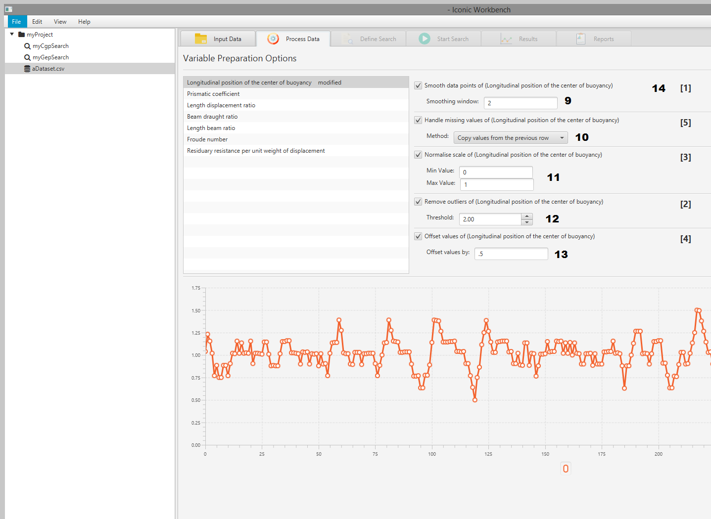

  9. Smoothing window input
 10. Missing values method dropdown
 11. Min and Max scale input
 12. Outlier Threshold input
 13. Offset value input
 14. Preprocessor order of operations

#### Define Search

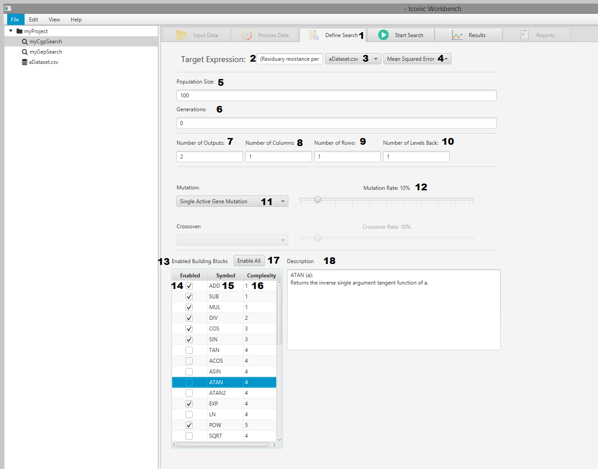

1. Define Search tab
2. Target expression input
3. Dataset selection dropdown
4. Error metric dropdown
5. Population size input
6. Number of generations input
7.  Number of outputs input
8. Number of columns input
9. Number of rows input
10. Number of levels back input
11. Mutation algorithm dropdown
12. Mutation rate slider
13. Building block display
14. Enable building block checkbox
15. Building block symbol
16. Building block complexity
17. Building block enable/disable all button
18. Building block description area

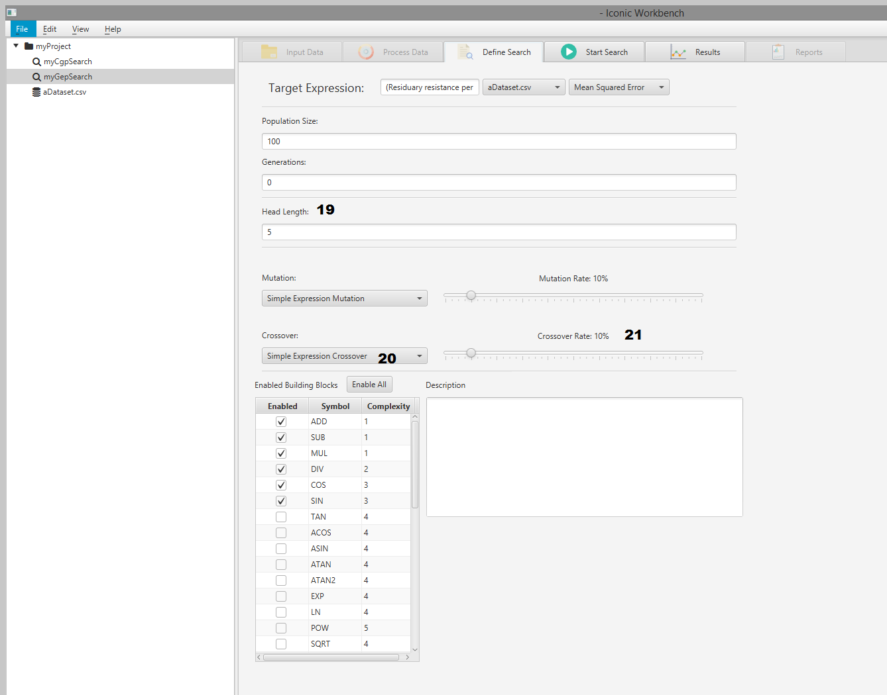

19. Head length input
20. Crossover algorithm dropdown
21. Crossover rate slider

#### Start Search


1. Start Search tab
2. Start search button
3. Pause search button
4. Stop search button
5. Search information display
6. Progress over time chart
7. Search console log

#### Results


1. Results tab
2. Results table
3. Size of solution
4. Error of solution
5. Solution expression
6. Solution fit plot

#### Dialogs

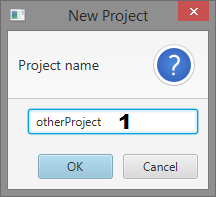

1. Project name input

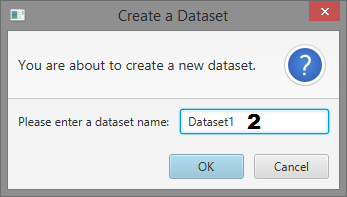

2. Dataset name input


3. Search name input
4. Search type selection dropdown

### Running a search
Below is a simple start to finish guide to running a search.

1. Start the Iconic Workbench
2. Click the "Import Dataset" button

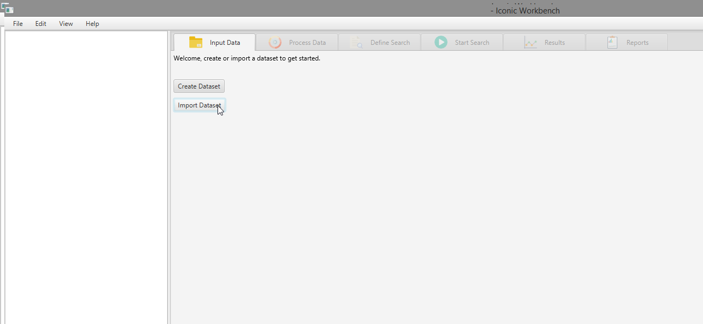

3. Navigate to and select a dataset, click "Open"


4. Enter a name for your project and click "OK"


5. Enter a search name, select a search and click "OK"
*Note: This guide uses the "Gene Expression Programming" search type*


6. Select the dataset in the project tree to view the data
*Note: You may edit the data by double-clicking a cell, entering a new value and pressing enter*

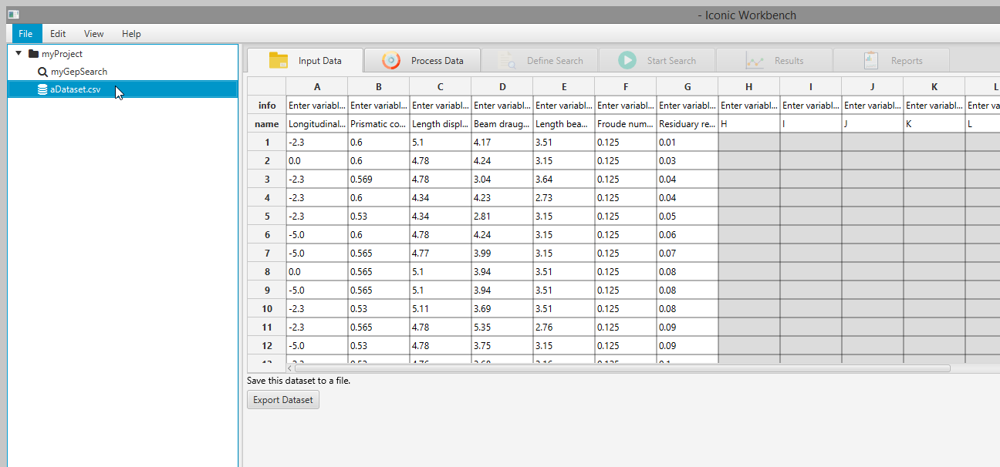

7. With the dataset selected, click the "Process Data" tab to view and process each feature individually
*Note: You may click individual features to plot them and apply preprocessing transformations on this screen*

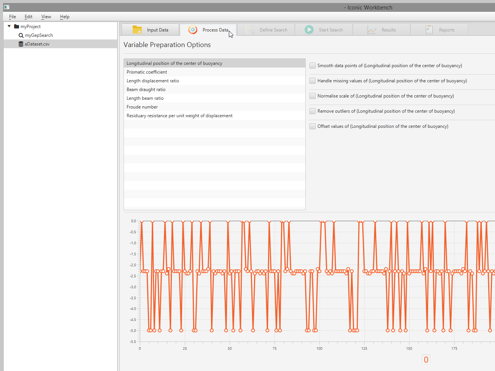

8. Select the search in the project tree, then select the "Define Search" tab
*Note: You may define search parameters on this screen. Besides selecting the dataset to use, modifying search parameters is optional*


9. Select a dataset from the dropdown menu
*Note: Selecting a dataset with missing values will give a warning. If your dataset has missing values, select the dataset in the project tree, navigate to the "Process Data" screen and enable "Handle missing values" for each feature with missing values*


10. OPTIONAL: Increase mutation and crossover rates

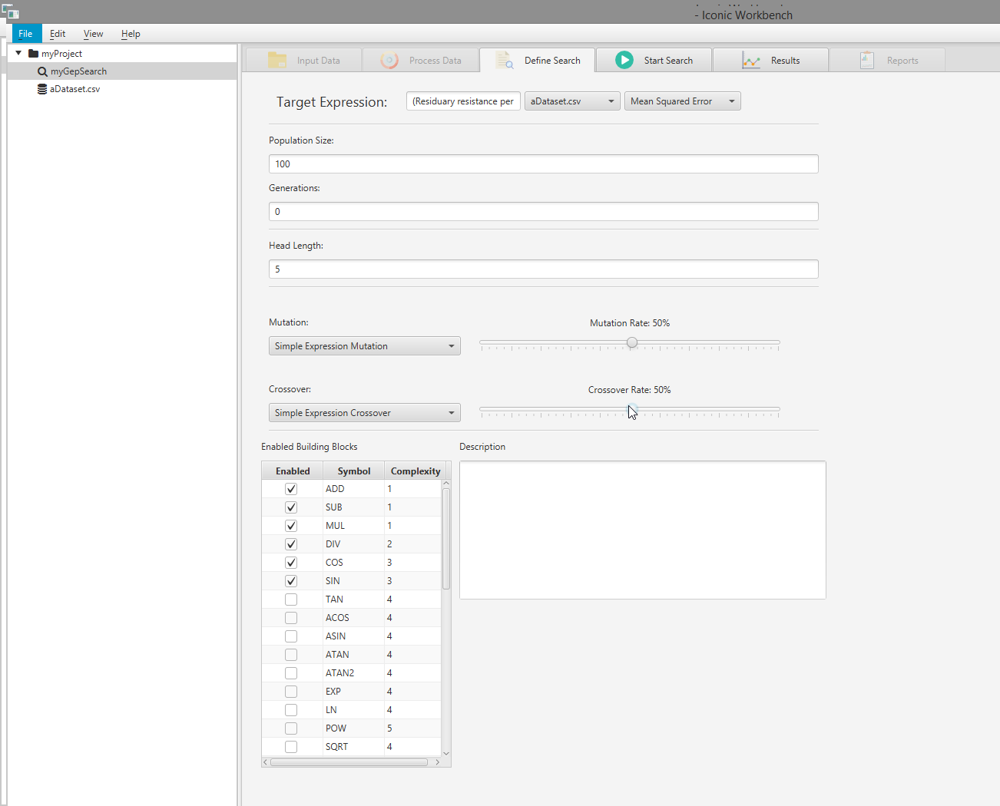

11. OPTIONAL: Enable and disable building blocks as necessary
*Note: For optimal results, you must choose building blocks which make sense for your dataset. In this example, SIN and COS are not appropriate for the dataset used. EXP and POW are more relevant, and have been enabled*


12. Click the "Start Search" tab and then start the search by clicking the "Start Search" button


13. The search will be started and you can immediately observe search progress

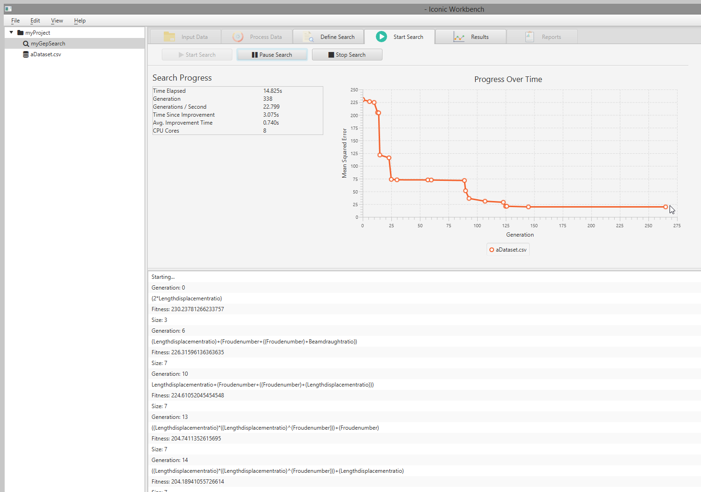

14. Click the "Results" tab and then select a result from the table to plot it
*Note: You may right click a result and select "Copy" to copy the expression to the clipboard


### Exiting the System

Before exiting the system, it is recommended to stop all running searches.

1. For each search in the project tree, select the search, navigate to the "Start Search" view and click the "Stop Search" button

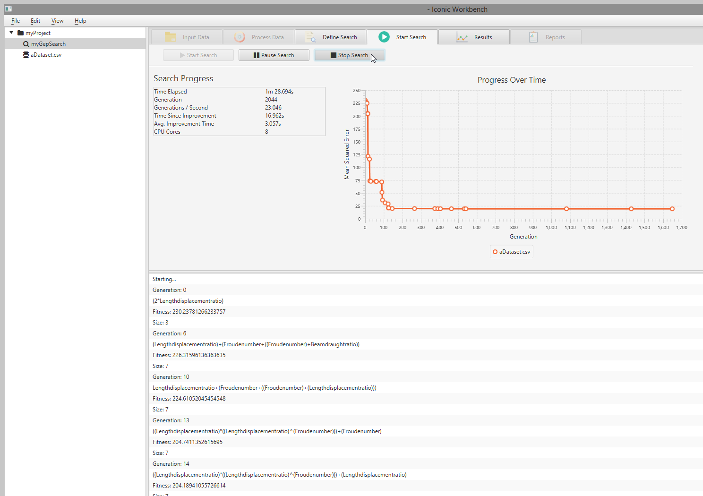

2. Click the exit button on the window, or navigate to the "File" menu located at the top left of the window and click "Exit"

## Using the System

The following sub-sections provide detailed, step-by-step instructions on how to use the various functions or features of the **Iconic Workbench**.

### Create a New Project
Projects provide logical groupings for multiple datasets and searches.
1. Click "File" in the menu bar then click "New Project..." OR press Ctrl+N
2. Give your project a name and click "OK"

Alternatively, if no project exists, you will be prompted to create one when importing or creating a dataset

### Import or Create a Dataset
You may either import an existing dataset in CSV format, or create one from scratch and enter or paste in values.
#### Import a Dataset
1. Create a project and select it in the project tree
2. Click the "Import Dataset" button on the "Input Data" screen
3. Navigate to the desired dataset using your systems file explorer
4. Select the dataset and click "Open"

#### Create a Dataset
1. Create a project and select it in the project tree
2. Click the "Create Dataset" button on the "Input Data" screen
3. Give the dataset a name and click "OK"

*NOTE: If a project does not exist, you will be asked to create one when importing or creating a dataset

### Add a Search
You may add multiple searches to a dataset. There are two types of searches to choose from : Gene Expression Programming or Cartesian Genetic Programming.

1. Create a project and select it in the project tree
2. Click the "New Search" button on the "Input Data" screen
3. Give the search a name
4. Select a search type
5. Click "OK"

### View & Edit a Dataset
You may view an edit the dataset in a spreadsheet view. This supports copy and paste both to and from Microsoft Excel
1. Import or create a dataset and select it in the project tree
2. Navigate to the "Input Data" screen
    a. Here you can view the dataset in a spreadsheet fashion
3. Double-click a cell to edit it, enter a new value and press the enter key or click out of the cell to save
4. Select a cell and press the delete key to remove the value
5. You may select multiple cells by clicking and dragging the mouse
6. You may copy data via right-click -> Copy OR Edit -> Copy in the menu bar OR by pressing Ctrl+C
7. You may paste data via selecting a cell, right-click -> Paste OR Edit -> Paste or by pressing Ctrl+V
8. You may edit the "name" row to change or give a name to the feature

### Export a Dataset
You may save a dataset from the Iconic Workbench to your system
1. Select a dataset in the project tree
2. Navigate to the "Input Data" screen
3. Click the "Export Dataset" button
4. Select a location, give the dataset a name (and file extension) and click "Save"

This will save the dataset in a CSV format

### Viewing Feature Data
You may view a plot of the data for each individual feature in the dataset
1. Select a dataset in the project tree
2. Navigate to the "Process Data" screen
3. Select a feature in the table

This will plot the data from that feature below. Additionally, a label "(missing values)" will appear next to the feature in the table if the feature is missing values.

### Preprocess Data
You may apply a number of transformations to each feature in the dataset. These can be enabled in a user specified order. This ordering will appear on the right hand side of the screen. Features with preprocessors applied will be labelled with "(modified)". This will not affect the dataset in the "Input Data" screen, nor will modified values be exported when exporting the dataset.

#### Smooth Data
You may smooth feature data using a sliding window approach. By default, the window is 2. This means that for every data point, we take the average or the two before, two after and the point itself. This becomes the new value for this data point. This is calculated in advanced before making any changes to the dataset. If there is no values immediately before or after the data point, the window will wrap around to the nearest point.
1. Select a feature in the feature table
2. Click the "Smooth data points of ..." checkbox
3. Adjust the window size as necessary, pressing enter to submit the new window size

#### Handle Missing Values
If the dataset is missing values, you **MUST** apply this preprocessor before any others can be applied. This is also true if the "Remove Outliers" (see below) preprocessor is applied and removes values from the dataset.
There are 5 methods for removing outliers:
* Copy values from previous row
* Set to the mean value
* Set to the median value
* Set to 0
* Set to 1
1. Select a feature in the feature table
2. Click the "Handle missing values of ..." checkbox
3. Choose a method from the drop-down menu

#### Normalise Scale
You may normalise the scale of the data points between two user defined values. For example, if your data range is 0 to 100, you can use this preprocessor to scale it between 0 and 1.
1. Select a feature in the feature table
2. Click the "Normalise scale of ..." checkbox
3. Set the minimum value and press the enter key
4. Set the maximum value and press the enter key

#### Remove Outliers
You may use this preprocessor to remove outlying data points from the feature. You may specify a threshold. A data point is considered an outlier if the distance between the data point and the mean value is greater than the threshold multiplied by IQR (interquartile range).
If outliers are removed, you must handle missing values before continuing.
1. Select a feature in the feature table
2. Click the "Remove outliers of ..." checkbox
3. Specify the threshold by entering a value into the box and pressing the enter key or by using the arrows
4. Apply the "Handle Missing Values" operation

#### Offset Values
You may offset each data point in the feature by a specified positive or negative amount.
1. Select a feature in the feature table
2. Click the "Offset values of ..." checkbox
3. Enter a value and press enter to apply

### Define Search Parameters
You may define the parameters to use when searching. Availability and display of some parameters are restricted to certain search types. For quick reference, you may hover over a label for an explanation.
Additional information may be found here: [Using the Command-Line](#using-the-command-line)

#### Select a dataset
You **MUST** select the dataset to search on
1. Select a search in the project tree
2. Navigate to the "Define Search" page
3. Select a dataset to use in the search via the "Select a dataset" drop-down menu

*Note: You will not be able to select a dataset if it is missing values. You must handle these missing values via the "Process Data" screen*

#### Target Function
This specifies the target function to search for. It allows you to define the input features and output (classifier) feature to use for searching.
1. Select a search in the project tree
2. Navigate to the "Define Search" page
3. Select a dataset to use in the search via the "Select a dataset" drop-down menu
    a. The target function will automatically fill out in the following format: (y) = f((x), (w), (...), (z)) where y = output = the last feature in the dataset, and x,w,...,z = input = the remaining features in the dataset.
4. You may change the target function as long as it adheres to the following rules:
    a. Each feature name must be encapsulated within parenthesis
    b. There may only be one feature on the left side of the equation
    c. The list of input features must be encapsulated within parenthesis with an 'f' prepended
    d. Each feature name must be separated by a comma, followed by a space (except the last feature)
5. Press the enter key

Target Expression Syntax

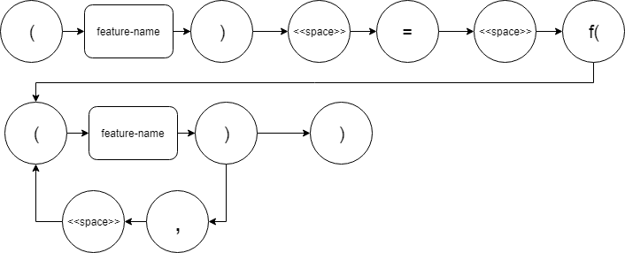

#### Building Blocks

These are the functional primitives to be included in the search. Each building block can be enabled or disabled individually, have their complexities set and will display a description when clicked.
1. Select a search in the project tree
2. Navigate to the "Define Search" page
3. Click the name of a building block to display its description on the right
4. Double click the name, or click the checkbox next to it, to toggle the building block enabled or disabled
5. Double click the complexity, enter a new value and press the enter key to change the complexity
6. Click the "Enable All" button to enable all building blocks
7. Click the "Disable All" button to disable all building blocks
    a. This button will only display if "Enable All" is pressed
    
##### Building block list
Below is a list of all currently implemented building blocks in alphabetical order

        ABS (a):
        Returns the positive value of a.

        ADD (a, b):
        Returns a + b.

        AND (a, b):
        Returns 1 if both a and b are greater than 0, 0 otherwise.

        ACOS (a):
        Returns the inverse cosine function of a.

        ASIN (a):
        Returns the inverse sine function of a.

        ATAN (a):
        Returns the inverse single argument tangent function of a.

        CEIL (a):
        Returns the integer of a rounded up.

        COS (a):
        Returns the cosine of a.

        DIV (a, b):
        Returns the division of a / b.

        EQUAL (a, b):
        Returns 1 if a is equal to b, 0 otherwise.

        EXP (a):
        Returns e^a.

        FLOOR (a):
        Returns the integer of a rounded down.

        GAUSS (a):
        Returns exp(-x^2), providing a normal distribution.

        GREATER (a, b):
        Returns 1 if a > b, 0 otherwise.

        GREATER_EQUAL (a, b):
        Returns 1 if a >= b, 0 otherwise.

        IF (a, b, c):
        Returns returns b if a > 0, c otherwise.

        LESS (a, b):
        Returns 1 if a < b, 0 otherwise.

        LESSEQUAL (a, b):
        Returns 1 if a <= b, 0 otherwise.

        LOGISTIC (a):
        Returns (1 / 1 + exp(-a)).
        This is a common sigmoid squashing function.

        MAX (a, b):
        Returns the maximum value of a and b.

        MIN (a, b):
        Returns the minimum value of a and b.

        MOD (a, b):
        Returns the remainder of a / b.

        MUL (a, b):
        Returns a * b.

        LN (a):
        Returns the natural logarithm (base e) of a.

        NEG (a):
        Returns - a.

        NOT (a):
        Returns 0 if a is greater than 0, 1 otherwise.

        OR (a, b):
        Returns 1 if either a or b are greater than 0, 0 otherwise.

        POW (a, b):
        Returns a^b.

        ROOT (a, b):
        Returns the b-th root of a if a is greater than 0, NaN otherwise.

        SGN (a):
        Returns -1 if a is negative, 1 if a is positive, 0 otherwise.

        SIN (a):
        Returns the sine of a.

        SQRT (a):
        Returns the square root of a.

        STEP (a):
        Returns 1 if x is positive, 0 otherwise.

        SUB (a, b):
        Returns a - b.

        TAN (a):
        Returns the tangent of a.

        TANH (a):
        Returns the hyperbolic tangent of a.
        This is a common squashing function returning a value between -1 and 1.

        ATAN2 (a, b):
        Returns the two argument inverse tangent function.

        XOR (a, b):
        Returns 1 if (a <= 0 and b > 0) or (a > 0 and b <= 0), 0 otherwise.


#### General Parameters
Below are the parameters which apply to both Gene Expression Programming and Cartesian Genetic Programming searches

##### Error Metric
This is the algorithm to use for determining result error. Currently, only Mean Squared Error is available

##### Population Size
This is the number of "children" to be generated each generation

##### Generations
This is the number of generations to run the search for. A value of 0 will run the search indefinitely

##### Mutation
This is the algorithm to use for mutation of chromosomes. Currently, only Single Active Gene Mutation is available. Mutation is a small random change in a chromosome

##### Mutation Rate
This is the chance of mutation as a percentage. The higher the mutation rate, the more chance a mutation will occur

#### Gene Expression Programming Specific Parameters
Below are the parameters which only apply to Gene Expression Programming searches

##### Head Length
This is the length of the Header to use.

The total length of the chromosome can be at minimum 1, and at max Header length + Tail length (where Tail length is Header length + 1). The Header part of the chromosome can pick building blocks, features of the dataset or constants. The Tail can only pick features or constants. The Tail was used to ensure that there is no leaf nodes expecting to have children.

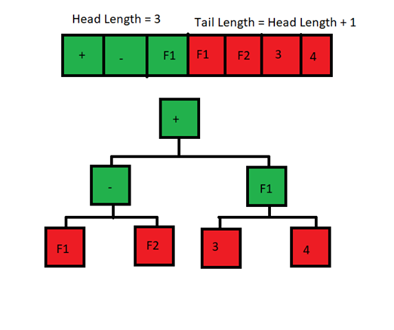

In this diagram, the green F1 (meaning feature 1 in the dataset) doesn't use its children because it doesn't need to. But if it was a building block like a "+" then it would end up needing it.

##### Crossover
This is the algorithm to use for crossover of chromosomes. Currently, only Simple Expression Crossover is available. Crossover is the act of replacing part of the child's genes with those of a parents within the population

##### Crossover Rate
This is the chance of crossover as a percentage. The higher the crossover rate, the more chance a crossover will occur

#### Cartesian Genetic Programming Specific Parameters
Below are the parameters which only apply to Cartesian Genetic Programming searches

##### Number of Outputs
The number of outputs that the CGP chromosome can have, effectively splitting a solution into multiple parts

##### Number of Columns
The number of columns in the CGP chromosomes dimensions

##### Number of Rows
The number of rows in the CGP chromosomes dimensions. It is recommended to set this value to 1 as default.

##### Number of Levels Back
The number of levels back that any node in the CGP chromosome can reach to connect to another node.

### Searching

#### Start a Search
To start a search:
1. Select a search in the project tree
2. Ensure the following
    a. Ensure a dataset has been selected for the search on the "Define Search" screen
    b. Ensure all missing values have been handled
    c. Ensure the target expression meets the syntax
3. Navigate to the "Start Search" screen
4. Click the "Start Search" button

#### Stop a Search
To stop a search:
1. Select a currently running search in the project tree
2. Navigate to the "Start Search" screen
3. Click the "Stop Search" button

#### Pause & Resume a Search
You may pause a search and resume from where it left off.
1. Select a currently running search in the project tree
2. Navigate to the "Start Search Screen"
3. Click the "Pause Search" button
4. While a search is paused, you may modify the following parameters: Mutation rate, Crossover rate (GEP only), Generations, Building Blocks
5. To resume the search, click the "Start Search" button

#### View Search Progress
The Iconic Workbench gives live information to the user about the search progress. This includes: Progress over time, Time elapsed, number of generations, generations per second, time since last improvement, average improvement time and number of CPU cores.
1. Select a currently running search
2. Navigate to the "Start Search" screen

### Results
You may view live information of the search results via the "Results" screen. This displays a table of results as well as a solution fit plot when a result is selected.

#### View Results Table & Solution Fit Plot
1. Select a currently running search in the project tree
2. Navigate to the "Results" screen
    a. Here you can view the best result of each size (number of primitives). It will display the solution size, error, and the solution itself.
    b. This table is sorted by smallest error in ascending order. You may change this ordering by clicking on the table headers
3. Click on a result in the table to view the solution fit plot
    a. The solution fit plot will evaluate the expression against the dataset and plot the "Actual" values (output of the expression) against the "Expected" values (feature specified as the output in the target expression)

#### Exporting a Solution
Currently, Iconic only supports copy & paste of solutions from the results table
1. Select a currently running search in the project tree
2. Navigate to the "Results" screen
3. Right-click a result in the table
4. Click "Copy"

### Other

#### Changing Workbench Theme
The Iconic Workbench supports different colour schemes. These are: Default, Dark, Bootstrap 2, Bootstrap 3

1. Click "View" in the menu bar
2. Select a theme

## Using the Command-Line

### Synopsis

```bash
$ java -jar iconic-cli.jar -i <file> --population <number> --generations <number> --outputs <number> --primitives <symbol,...> [--graph] [--csv]
```

### Description

`iconic-cli` is a simple command-line tool designed to expedite the generation of models without relying
on a graphical user interface. The current version `0.7.0` only uses 
`Global Simple Evolutionary Algorithm for Multiple Objectives (GSEMO)` with cartesian (graph-based) chromosomes on
two pre-defined objectives that minimise the:

 1. mean squared error, and,
 2. genome's size

`iconic-cli` takes a single input file, a population size and a number of generations.

While running it prints the current progress as a percentage of generations elapsed versus total generations,
the current least error and smallest size, and the total amount of time elapsed.


The output of each run will be placed in a new folder named after the input file, arranged in subfolders according to 
the date the run was initiated. Unless additional flags are included only a README file will be output 
containing each of the parameters used and their values. 

```bash
$ java -jar iconic-cli.jar ...
$ ...
$ ls .
```

After running:

```bash
$ ls .
    Directory: C:\Path\to\iconic-cli
    

Mode                LastWriteTime         Length Name
----                -------------         ------ ----
d-----       31/10/2018  11:46 AM                inputFile          # Output directory
-a----       22/10/2018   2:21 PM                inputFile.csv
-a----       16/10/2018   9:29 AM                iconic-cli.jar
```

### Type of Algorithm

`(-a | --algorithm) <GENE_EXPRESSION_PROGRAMMING | CARTESIAN_GENETIC_PROGRAMMING>`

The type of algorithm determines which algorithm should be used to perform the search.
As of version `0.7.0` this parameter is ignored as only `GSEMO` with cartesian chromosomes
is used.

### Choosing the Input File

`(-i | --input) <string>`

The input file is a comma delimited list of values where each line is a new sample. 
The current version `0.7.0` doesn't support input files with column headers.

```csv
0, 1, 0.25
1, 1, 0.5
0, 0, 1
```

### Number of Outputs

`--outputs <integer>`

The number of outputs is used to specify how many outputs a chromosome can have.
If the chromosome doesn't support multiple outputs this parameter will be ignored.

In the current version `0.7.0` chromosomes with multiple outputs have each output summed
together to produce a single output.

### Number of Generations

`(-g | --generations) <integer>`

The number of generations is used to specify how many generations to let the population evolve.
Unlike the `Iconic Workbench` the number of generations must be greater than zero.

### Size of Population

`(-p | --population) <integer>`

The population size is used to specify the size of the initial starting population.
This is less meaningful with `GSEMO` as the population grows dynamically with only Pareto-optimal solutions 
being kept for the next generation. Setting an initial population size greater than one can still be
used to increase the genetic diversity of the initial population.

### Primitives to Use

`--primitives <symbol>,...`

The primitive set used by the algorithm must be specified as a list of comma-delimited symbols. 
If no primitives are specified all available primitives will be used by default.

`--primitives ADD,MUL,DIV,SUB,LOG,SIN`

A full list of available primitives can be seen by using `--listPrimitives`.

### Crossover Probability

`(-cP | --crossoverProbability) <percentage in range [0.0, 1.0]>`

The probability of crossover being used on an offspring during each instance of the
evolutionary cycle. 
A crossover probability of `1.0` will cause crossover to always occur in each cycle,
whereas a probability of `0.0` will prevent crossover from ever occurring.

*The crossover probability will only take effect if the algorithm uses a crossover operator.
In version `0.7.0` no crossover is included by default with no way to change it.*

### Mutation Probability

`(-mP | --mutationProbability) <percentage in range [0.0, 1.0]>`

The probability of mutation being used on an offspring during each instance of the 
evolutionary cycle. 
A mutation probability of `1.0` will cause mutation to always occur in each cycle,
whereas a probability of `0.0` will prevent mutation from ever occurring.

*The mutation probability will only take effect if the algorithm uses a mutator.
In version `0.7.0` a mutator is included by default with no way to change it.*

### Number of Repetitions

`(-r | --repeat) <integer>`

The number of repetitions (trials) to repeat the experiment for. Each trial will use the 
same parameters as specified. 

If the `--graph` or `--csv` flags are enabled then the
results from each trial will be included within the same output file(s).

### Graphing the Results

`--graph`

If this flag is included `iconic-cli` will export the results to several charts in the PNG format.
These charts will be placed in the same output folder as the default output files.

The charts generated include a plot of every generation's non-dominated set, the last generation's
non-dominated set, and a solution-fit plot of the overall Pareto-optimal set.

Non-dominated solutions from every generation

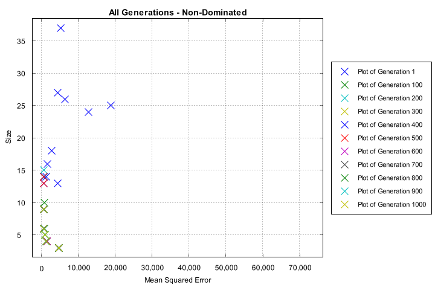

Non-dominated solutions from the last generation

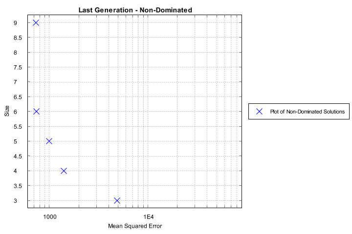

Overall Pareto-optimal set's solution fit

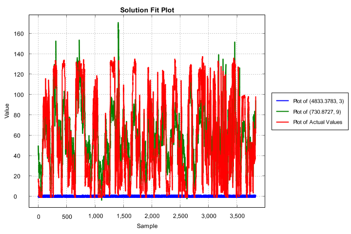
 
### Exporting the Results as CSV

`--csv`

If this flag is included `iconic-cli` will export the results to several CSV files.
These CSV files will be placed in the same output folder as the default output files.

The CSV files generated include a list of chromosomes from every generation's non-dominated set,
and the chromosomes from the last generation's non-dominated set.
Chromosomes are formatted as a 3-tuple of (mean squared error, size, model).

### Cartesian-Specific Parameters

These parameters are exclusive to cartesian chromosomes. If any other type of chromosome
is used any option specified here will be ignored.

*Version `0.7.0` doesn't support the use of other chromosomal types so these parameters will
never be ignored.*

#### Number of Columns

`(--columns) <integer>`

The number of columns that the chromosome should use. A cartesian chromosome stores
its genotype as a graph, this parameter specifies the columnar dimensions of that graph.

#### Number of Rows

`(--rows) <integer>`

The number of rows that the chromosome should use. A cartesian chromosome stores
its genotype as a graph, this parameter specifies the row dimensions of that graph.

In general there is no reason to use a number of rows other than one as there's
always a functionally equivalent one-dimensional graph. If in doubt set this 
parameter to one.

#### Number of Levels Back

`(--levelsBack) <integer>`

The maximum number of levels back that any node within the chromosome can connect to. 
A cartesian chromosome stores its genotype as a graph, this parameter specifies how
far back in terms of columns that any node in the graph can reach. If a column is in
range the node may connect to any other node in that column.

A maximum number of levels back that's equal to or greater than the number of columns in
the chromosome means that any node in the graph can connect to any other node preceding it.
Reducing the maximum number of levels back will force the chromosome to produce larger
models.

# Support & Contact

The Iconic team has stopped official implementation of the Iconic project on 02/11/2018. The Iconic team is not obligated in any way to maintain the system or provide support for end users. Contact information is provided below as a courtesy. Feel free to contact

##### Table 1 - Support Points of Contact
|Contact - Org|Email|Role|Responsibility|
|:---:|---|---|---|
|Jayden Urch - Iconic|jayden.urch@uon.edu.au|Project Manager|Project management|
|Tim Pitts - Iconic|timothy.pitts@uon.edu.au|Client Communications|External resourcing and communications|
|Jasbir Shah - Iconic|jasbir.shah@uon.edu.au|Developer|Search algorithm and CLI expert|
|Lachlan Meyer - Iconic|lachlan.meyer@uon.edu.au|Developer|Repository Owner|
|Dr Pablo Moscato - UoN|pablo.moscato@newcastle.edu.au|Course Manager|Subject matter expert|
|Dr Markus Wagner - UoA|markus.wagner@adelaide.edu.au|Primary Client|Project direction and features|
